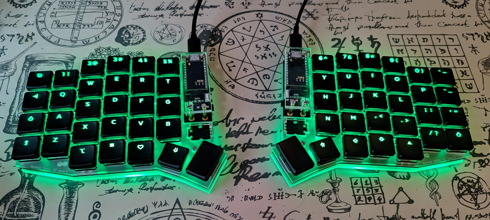
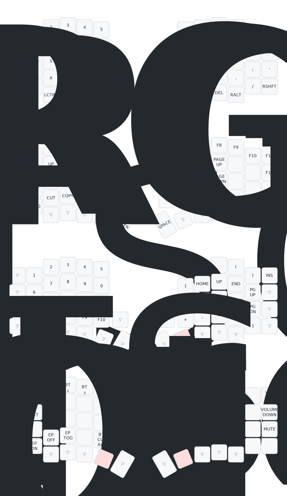

# ZMK config for Aurora Sofle v2 rev1.1

## Current layout

- Edited with [keymap editor](https://nickcoutsos.github.io/keymap-editor/)
- Generated using [a visualizer for keymaps app](https://keymap-drawer.streamlit.app/)

## Relevant sources

- Design files from [splitkb aurora](https://github.com/splitkb/aurora/tree/master/Aurora%20Sofle%20v2)
