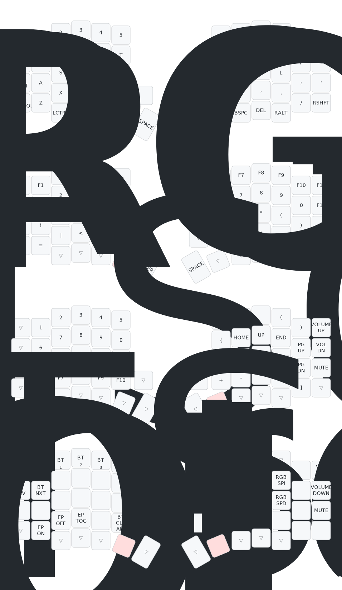

# ZMK config for Aurora Sofle v2 rev1.1

## Current layout

- Edited with [keymap editor](https://nickcoutsos.github.io/keymap-editor/)
- Generated using [a visualizer for keymaps app](https://keymap-drawer.streamlit.app/)

## Relevant sources

- Design files from [splitkb aurora](https://github.com/splitkb/aurora/tree/master/Aurora%20Sofle%20v2)

## Changelog

- added left encoder
  - https://github.com/zmkfirmware/zmk/issues/72#issuecomment-2082651732 for mouse scroll emulation

### 2024-01-29

- soldering and first build
- initial keymap tuning
- learning the board and first time use
- starting point 12wpm on monkeytype
